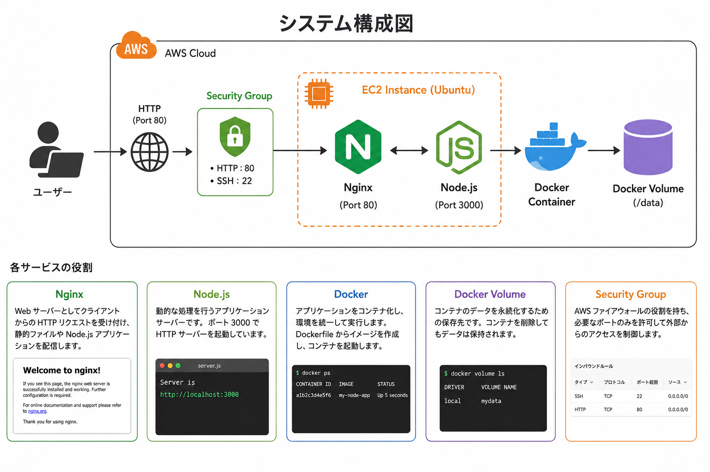
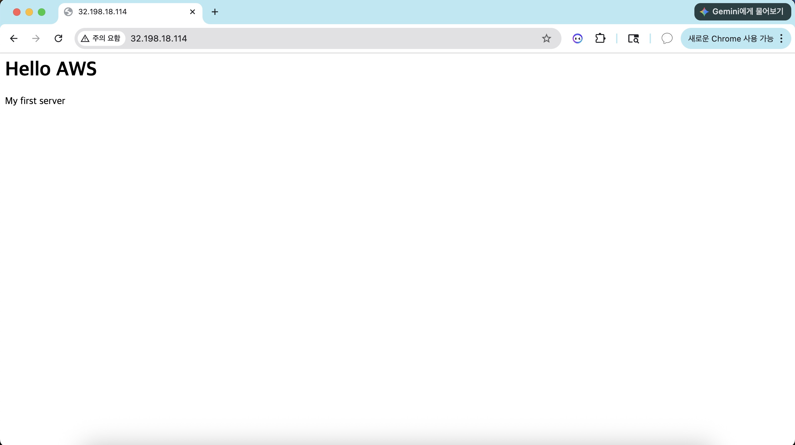
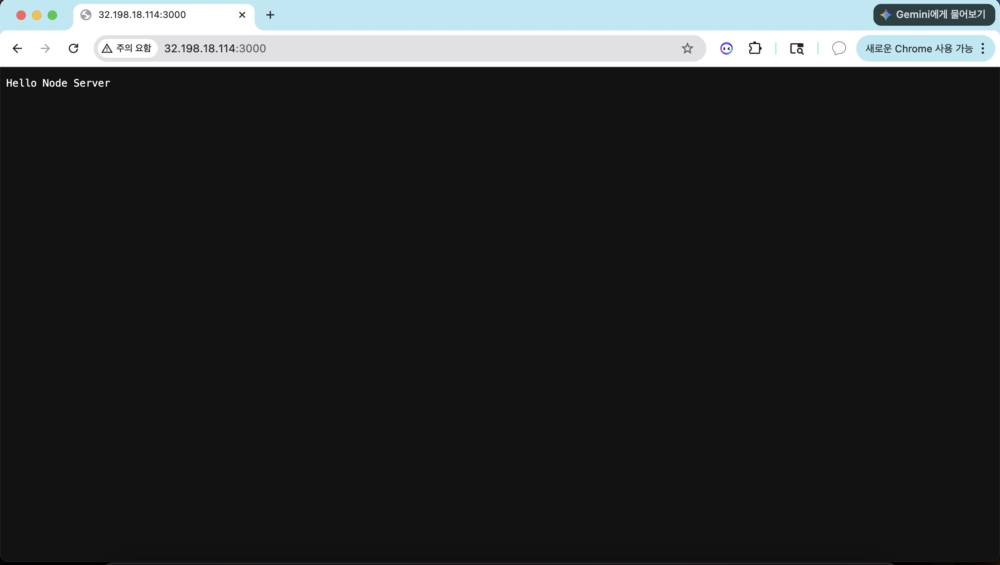
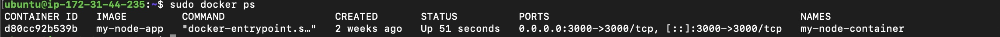
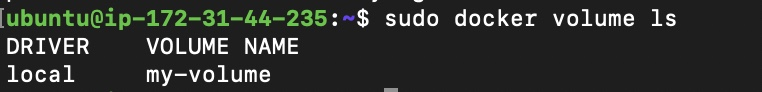

# AWS Linux Web Server 構築プロジェクト

---

# プロジェクト概要

AWS EC2（Ubuntu）上にLinuxサーバーを構築し、NginxとNode.jsを利用したWebアプリケーションをインターネットへ公開したプロジェクトです。

EC2インスタンスの作成、SSHによるリモート接続、Linuxサーバーの設定、AWS Security Groupの構成、Nginx Webサーバーの構築、Node.jsアプリケーションの実行、Dockerによるコンテナ化まで一連の構築を行いました。

また、構築中に発生したネットワークやサーバーの問題について、Linuxコマンドやログを利用して原因を調査し、解決まで実施しました。

---

# システム構成

---

# 使用技術

| 分類 | 技術 |
|------|------|
| Cloud | AWS EC2 |
| OS | Ubuntu Linux |
| Web Server | Nginx |
| Application | Node.js |
| Container | Docker / Docker Volume |
| Remote Access | SSH |
| Version Control | Git / GitHub |

---

# 主な構築内容

## EC2・Linux環境構築

- AWS EC2（Ubuntu）インスタンス作成
- SSHによるリモート接続
- Linux基本操作
- Linuxサービス・プロセス管理
- ネットワーク確認

---

## Nginx Web Server

Nginxをインストールし、AWS Security Groupを設定して外部公開しました。

ブラウザから正常にアクセスできることを確認しました。

---

## Node.js Application

Node.js HTTP Serverを作成し、3000番ポートで公開しました。

ブラウザからアプリケーションへアクセスし、正常にレスポンスが返ることを確認しました。

---

## Docker

Dockerfileを作成し、Node.jsアプリケーションをDocker ImageとしてBuildしました。

作成したImageからContainerを起動し、ブラウザから正常にアクセスできることを確認しました。

---

## Docker Volume

Docker Volumeを利用してデータを永続化しました。

Containerを削除・再作成した後も保存したデータが保持されることを確認しました。

---

# トラブルシューティング

## ① ブラウザからNginxへアクセスできない

### 原因

AWS Security GroupでHTTP（TCP 80）が許可されていませんでした。

### 対応

Inbound RuleへHTTP（TCP 80）を追加しました。

### 結果

EC2 Public IPから正常にアクセスできることを確認しました。

---

## ② Docker Container削除後にデータが消える

### 原因

Container内部のデータはContainerのライフサイクルに依存していました。

### 対応

Docker Volumeを作成し、`/data`ディレクトリへマウントしました。

### 結果

Containerを再作成した後もデータが保持されることを確認しました。

---

# このプロジェクトで学んだこと

- AWS EC2を利用したLinuxサーバー構築
- SSHによるリモートサーバー管理
- Linuxサービスおよびプロセス管理
- Security Groupとポート制御の仕組み
- NginxによるWebサーバー公開
- Node.jsアプリケーションの実行
- Docker ImageとContainerの違い
- Docker Volumeによるデータ永続化
- トラブル発生時の原因調査と問題解決

---

# 今後の改善予定

- Nginx Reverse Proxy構成
- Docker Compose導入
- HTTPS（Let's Encrypt）対応
- AWS RDSとの連携
- CloudWatchによる監視環境構築

---

# 詳細ドキュメント

- [01. EC2構築](docs/01-EC2.md)
- [02. Linux基本操作](docs/02-Linux.md)
- [03. Nginx構築](docs/03-Nginx.md)
- [04. Node.js](docs/04-Nodejs.md)
- [05. Docker](docs/05-Docker.md)
- [06. Docker Volume](docs/06-Docker-Volume.md)
