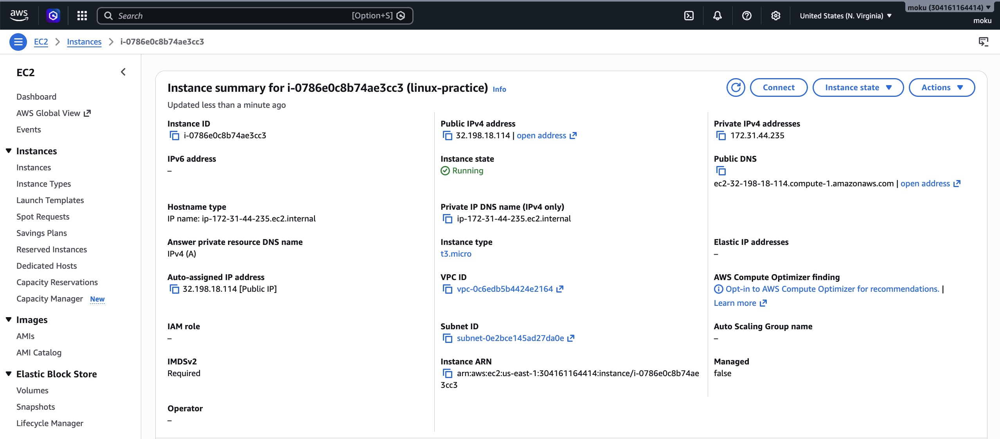
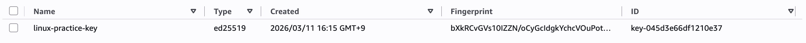
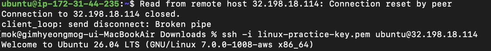
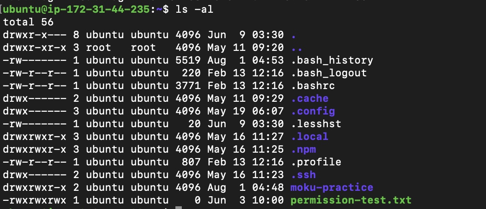

# 01. AWS EC2 構築

## プロジェクト概要

AWS EC2（Ubuntu）上にLinuxサーバーを構築し、Nginx・Node.js・Dockerを実行するための環境を構築しました。

本ドキュメントでは、EC2インスタンスの作成からSSH接続までの構築手順をまとめています。

---

# EC2とは

Amazon EC2（Elastic Compute Cloud）は、AWSが提供する仮想サーバーサービスです。

必要なときにサーバーを作成・削除できるため、多くの企業で利用されています。

本プロジェクトではUbuntu Linux環境を構築するためにEC2を利用しました。

---

# 構築環境

| 項目 | 内容 |
|------|------|
| Cloud | AWS EC2 |
| OS | Ubuntu Linux |
| Region | ap-northeast-1 (Tokyo) |
| Instance Type | t3.micro |
| Authentication | SSH Key Pair |

---

# EC2インスタンス作成

Ubuntu LinuxのEC2インスタンスを作成しました。

設定内容

- Ubuntu AMI
- t3.micro
- Public IPv4有効
- Security Group作成
- SSH Key Pair作成

### 実行画面



---

# Key Pair作成

SSH接続に利用するKey Pairを作成しました。

秘密鍵（.pem）はローカルPCに保存し、公開鍵はAWS側で管理されます。

### 実行画面



---

# SSH接続

Mac TerminalからEC2へSSH接続しました。

使用コマンド

```bash
chmod 400 linux-practice-key.pem

ssh -i linux-practice-key.pem ubuntu@Public-IP
```

秘密鍵の権限を400へ変更し、安全にSSH認証を行いました。

### 実行画面



---

# 接続確認

SSH接続後、基本コマンドを利用してサーバー環境を確認しました。

使用コマンド

```bash
whoami

pwd

hostname -I

ls -al
```

確認内容

- ログインユーザー
- 現在ディレクトリ
- Private IP
- ファイル一覧

### 実行画面



---

# 使用した主なコマンド

| コマンド | 説明 |
|----------|------|
| ssh | EC2へリモート接続 |
| chmod 400 | SSH秘密鍵の権限設定 |
| pwd | 現在のディレクトリ確認 |
| ls -al | ファイル・権限確認 |
| whoami | ログインユーザー確認 |
| hostname -I | Private IP確認 |

---

# トラブルシューティング

## SSH接続に失敗

### 原因

- Key Pairのパスが誤っていた
- 秘密鍵の権限が適切ではなかった

### 対応

秘密鍵を保存したディレクトリへ移動し、

```bash
chmod 400 linux-practice-key.pem
```

を実行しました。

また、Public IPv4アドレスを確認し、再接続しました。

### 結果

正常にEC2へSSH接続できることを確認しました。

---

# 学んだこと

- EC2はクラウド上の仮想サーバーであること
- SSHによる安全なリモート接続方法
- Key Pairを利用した公開鍵認証
- Security Groupによるアクセス制御
- EC2はWebサーバーやアプリケーションの実行基盤となること
