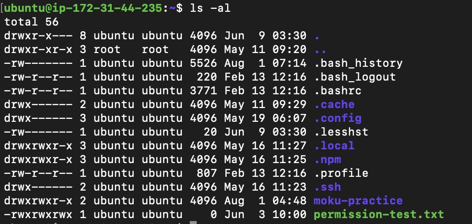
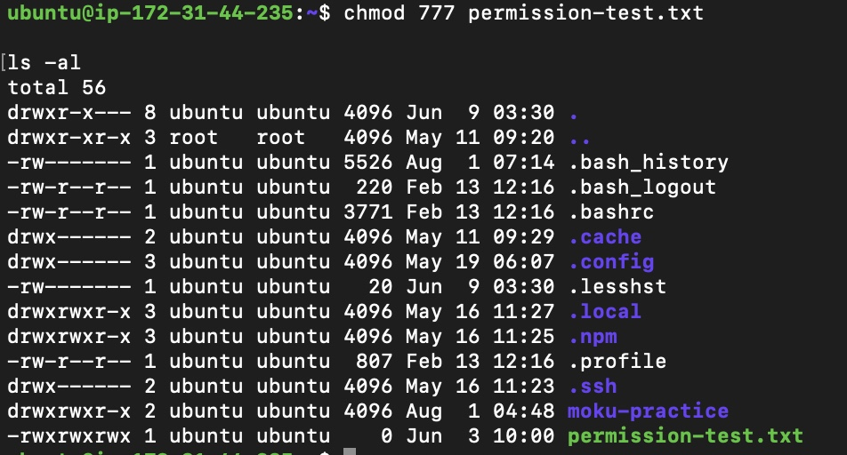
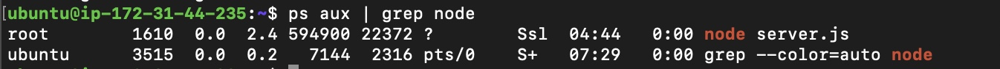
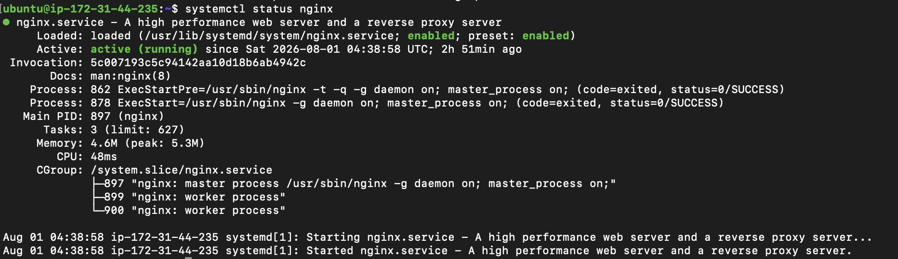
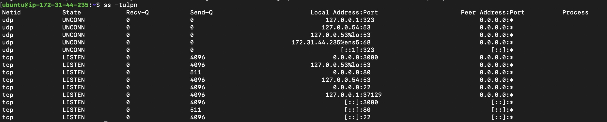
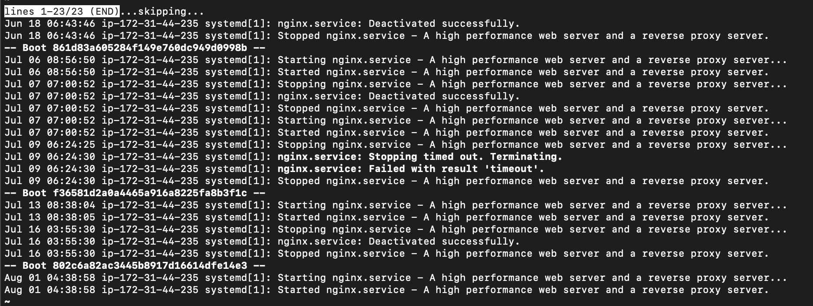

# 02. Linux 基本操作

## プロジェクト概要

AWS EC2（Ubuntu）上でLinuxの基本操作を実施しました。

ファイル・ディレクトリ管理、アクセス権限、プロセス管理、サービス管理、ログ確認、ネットワーク状態の確認を行い、サーバー管理に必要な基本操作を習得しました。

---

# Linuxとは

Linuxはサーバーで最も広く利用されているオペレーティングシステム（OS）です。

AWS EC2をはじめ、多くのクラウド環境で採用されており、Webサーバーやデータベース、アプリケーションサーバーなど様々なシステムの基盤として利用されています。

本プロジェクトではUbuntu Linuxを使用しました。

---

# 実施内容

- ファイル・ディレクトリ管理
- ファイルアクセス権限管理
- プロセス管理
- サービス管理
- ネットワーク状態確認
- システムログ確認

---

# ファイル・ディレクトリ管理

使用コマンド

```bash
pwd
ls -al
mkdir
cd
touch
cp
mv
rm
```

実施内容

- 現在のディレクトリ確認
- ディレクトリ作成・移動
- ファイル作成
- ファイルコピー
- ファイル名変更
- ファイル削除

### 実行画面



---

# ファイルアクセス権限

Linuxではファイルごとにアクセス権限を設定できます。

実施内容

```bash
chmod 777 permission-test.txt
```

確認

```bash
ls -al
```

権限変更後、`ls -al`でアクセス権限が変更されることを確認しました。

### 実行画面



---

# プロセス管理

実行中のプロセスを確認しました。

使用コマンド

```bash
ps aux

ps aux | grep node

top
```

また、Node.jsプロセスを終了するために以下のコマンドも使用しました。

```bash
kill PID

kill -9 PID
```

### 実行画面



---

# サービス管理

systemdを利用してサービスの状態を管理しました。

使用コマンド

```bash
systemctl status nginx

systemctl start nginx

systemctl stop nginx

systemctl restart nginx
```

Nginxサービスの起動・停止・状態確認を実施しました。

### 実行画面



---

# ネットワーク確認

サーバーのネットワーク状態を確認しました。

使用コマンド

```bash
hostname -I

ip addr

ss -tulpn

curl http://localhost

ping google.com
```

TCPポートやIPアドレス、Webサーバーの応答を確認しました。

### 実行画面



---

# ログ確認

systemdログを利用してNginxの状態を確認しました。

使用コマンド

```bash
journalctl -u nginx

journalctl -u nginx -n 20

journalctl -u nginx -f
```

サービスの起動・停止やエラー内容を確認できることを学びました。

### 実行画面



---

# 使用した主なコマンド

| コマンド | 用途 |
|----------|------|
| pwd | 現在のディレクトリ確認 |
| ls -al | ファイル一覧・権限確認 |
| mkdir | ディレクトリ作成 |
| cd | ディレクトリ移動 |
| touch | ファイル作成 |
| cp | ファイルコピー |
| mv | ファイル移動・名前変更 |
| rm | ファイル削除 |
| chmod | ファイル権限変更 |
| ps | プロセス確認 |
| top | システム状態確認 |
| kill | プロセス終了 |
| systemctl | サービス管理 |
| journalctl | ログ確認 |
| hostname -I | IPアドレス確認 |
| ip addr | ネットワーク情報確認 |
| ss | TCP/UDPポート確認 |
| curl | HTTP応答確認 |
| ping | ネットワーク疎通確認 |

---

# 学んだこと

- Linuxの基本的なファイル・ディレクトリ操作
- chmodによるアクセス権限管理
- プロセスとサービスの違い
- systemctlによるサービス管理方法
- journalctlを利用したログ確認方法
- ssを利用したポート確認方法
- ネットワークとWebサーバーの動作確認方法
- 問題発生時にログ・プロセス・ポートを順番に確認する重要性
