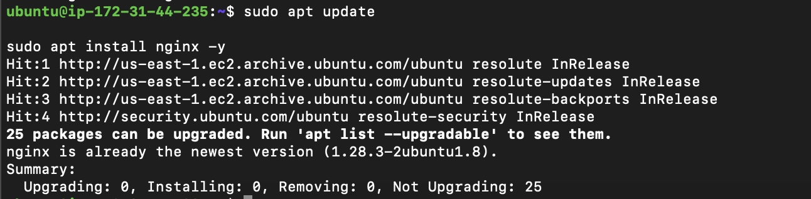
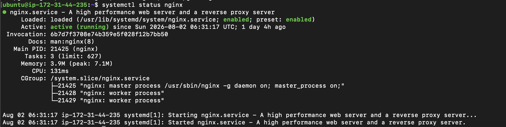
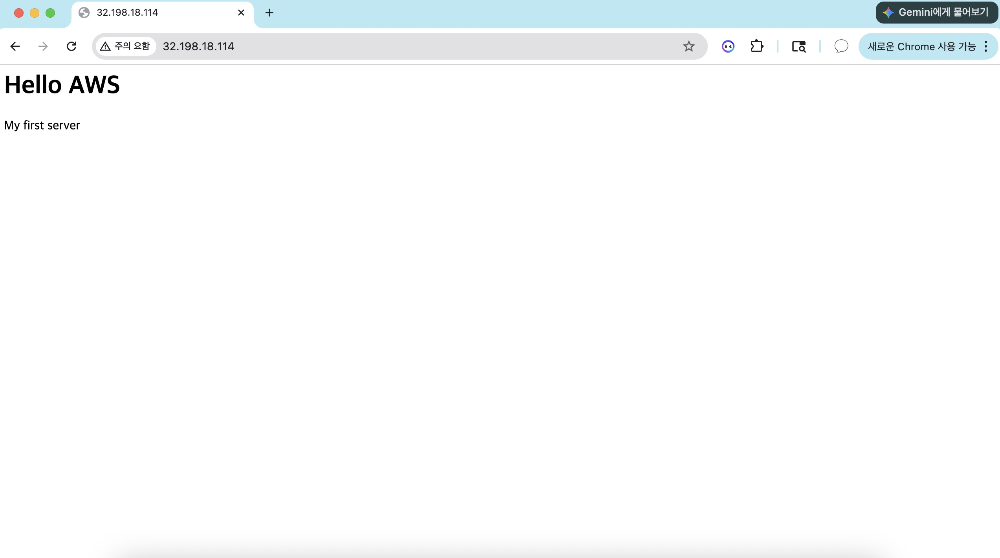
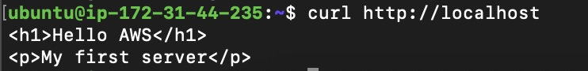
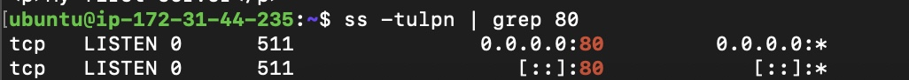

# 03. Nginx Web Server 構築

## プロジェクト概要

AWS EC2（Ubuntu）上にNginxをインストールし、Webサーバーを構築しました。

Nginxを利用して作成したHTMLページをインターネットへ公開し、ブラウザから正常にアクセスできることを確認しました。

また、Linuxコマンドを利用してサービス状態・ポート・HTTPレスポンスを確認し、Webサーバーの動作を検証しました.

---

# Nginxとは

Nginx（Engine X）は、高性能なWebサーバーおよびリバースプロキシソフトウェアです。

静的コンテンツの配信だけでなく、リバースプロキシやロードバランサーとしても利用されており、多くのWebサービスで採用されています。

本プロジェクトでは、Webページを公開するWebサーバーとして利用しました。

---

# 構築環境

| 項目 | 内容 |
|------|------|
| OS | Ubuntu Linux |
| Web Server | Nginx |
| Protocol | HTTP |
| Port | TCP 80 |

---

# Nginxのインストール

APTパッケージマネージャーを利用してNginxをインストールしました。

使用コマンド

```bash
sudo apt update
sudo apt install nginx -y
```

### 実行画面



---

# サービス状態の確認

Nginxサービスが正常に起動していることを確認しました。

使用コマンド

```bash
systemctl status nginx
```

また、サービスの開始・停止・再起動も実施しました。

```bash
sudo systemctl start nginx
sudo systemctl stop nginx
sudo systemctl restart nginx
```

### 実行画面



---

# Webページ公開

Nginxのデフォルトページではなく、自分で作成したHTMLページへ変更し、Public IPを利用してブラウザからアクセスできることを確認しました。

アクセスURL

```
http://Public-IP
```

表示内容

```
Hello AWS
My first server
```

### 実行画面



---

# HTTPレスポンス確認

ブラウザだけではなく、サーバー内部からもHTTPレスポンスを確認しました。

使用コマンド

```bash
curl http://localhost
```

HTMLレスポンスが正常に返されることを確認しました。

### 実行画面



---

# ポート確認

NginxがTCP 80番ポートでリクエストを待機していることを確認しました。

使用コマンド

```bash
ss -tulpn | grep 80
```

確認内容

- TCP
- LISTEN
- 0.0.0.0:80

### 実行画面



---

# HTTPリクエストの流れ

ブラウザからアクセスした際の通信経路は以下の通りです。

```text
Browser
    │
HTTP Request
    │
AWS Security Group
    │
EC2 Ubuntu
    │
Nginx
    │
HTML Response
    │
Browser
```

Nginxは80番ポートでHTTPリクエストを待機し、リクエストを受信するとHTMLファイルをレスポンスとして返します。

---

# 使用した主なコマンド

| コマンド | 用途 |
|----------|------|
| apt install nginx | Nginxインストール |
| systemctl status | サービス状態確認 |
| systemctl start | サービス開始 |
| systemctl stop | サービス停止 |
| systemctl restart | サービス再起動 |
| curl | HTTPレスポンス確認 |
| ss | ポート確認 |

---

# トラブルシューティング

## ブラウザからWebページへアクセスできない

### 原因

AWS Security GroupでHTTP（TCP 80）が許可されていませんでした。

### 対応

Security GroupのInbound RuleへHTTP（TCP 80）を追加しました。

また、Nginxサービスが正常に起動していることを確認しました。

```bash
systemctl status nginx
```

### 結果

EC2のPublic IPから作成したWebページへ正常にアクセスできることを確認しました。

---

# 学んだこと

- NginxはWebサーバーとしてHTTPリクエストを処理するソフトウェアであること
- `systemctl`を利用してサービスの状態を管理できること
- `curl`を利用してサーバー内部からHTTPレスポンスを確認できること
- `ss`を利用してWebサーバーが待機しているポートを確認できること
- Webページを公開するためにはNginxだけでなく、AWS Security Groupの設定も重要であること
- デフォルトページを自作のHTMLへ変更することで、独自のWebページを公開できること
