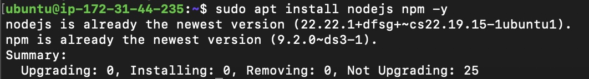
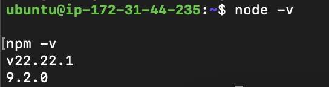
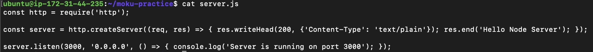
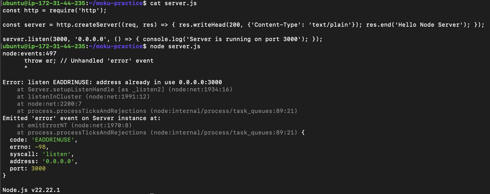
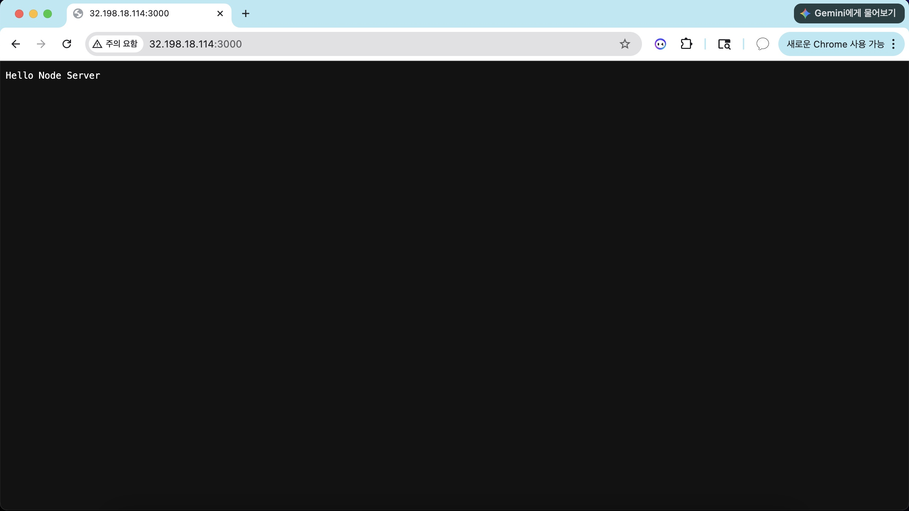
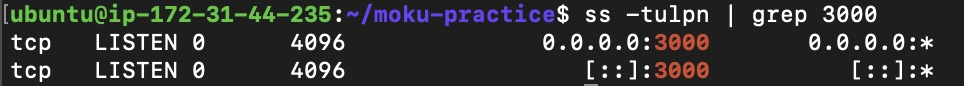
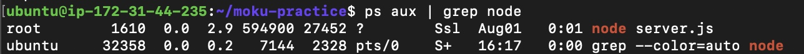

# 04. Node.js Application Server 構築

## プロジェクト概要

AWS EC2（Ubuntu）上にNode.jsをインストールし、シンプルなHTTPサーバーを構築しました。

EC2上で`server.js`を作成し、Node.jsアプリケーションを実行しました。また、ブラウザからアクセスできることを確認し、Linuxコマンドを利用してプロセスやポートの状態を確認しました。

---

# Node.jsとは

Node.jsは、JavaScriptをサーバーサイドで実行するためのランタイムです。

通常JavaScriptはブラウザで動作しますが、Node.jsを利用することでLinuxサーバー上でもJavaScriptを実行できます。

本プロジェクトでは、HTTPサーバーを構築するためにNode.jsを利用しました。

---

# 構築環境

| 項目 | 内容 |
|------|------|
| OS | Ubuntu Linux |
| Runtime | Node.js |
| Package Manager | npm |
| Protocol | HTTP |
| Port | TCP 3000 |

---

# Node.jsのインストール

Node.jsとnpmをインストールしました。

使用コマンド

```bash
sudo apt install nodejs npm -y
```

### 実行画面



---

# バージョン確認

インストール後、Node.jsとnpmのバージョンを確認しました。

使用コマンド

```bash
node -v

npm -v
```

### 実行画面



---

# HTTPサーバー作成

EC2上で`server.js`を作成し、Node.jsの標準モジュールである`http`を利用してHTTPサーバーを実装しました。

使用コマンド

```bash
nano server.js
```

作成したソースコードを確認しました。

```bash
cat server.js
```

サーバーはTCP3000番ポートで待機し、ブラウザからアクセスすると「Hello Node Server」を返すように実装しました。

### 実行画面



---

# アプリケーション実行

作成したNode.jsアプリケーションを実行しました。

使用コマンド

```bash
node server.js
```

正常に起動すると以下のメッセージが表示されます。

```
Server is running
```

### 実行画面



---

# ブラウザ確認

ブラウザからEC2のPublic IPへアクセスし、Node.jsアプリケーションが正常に動作していることを確認しました。

アクセスURL

```
http://Public-IP:3000
```

表示内容

```
Hello Node Server
```

### 実行画面



---

# ポート確認

Node.jsがTCP3000番ポートで待機していることを確認しました。

使用コマンド

```bash
ss -tulpn | grep 3000
```

確認内容

- TCP
- LISTEN
- 0.0.0.0:3000

### 実行画面



---

# プロセス確認

Node.jsプロセスが正常に実行されていることを確認しました。

使用コマンド

```bash
ps aux | grep node
```

また、不要になったプロセスは終了しました。

```bash
kill PID
```

### 実行画面



---

# HTTPリクエストの流れ

```text
Browser
    │
HTTP Request
    │
AWS Security Group
    │
EC2 Ubuntu
    │
Node.js
    │
HTTP Response
    │
Browser
```

Node.jsはTCP3000番ポートでHTTPリクエストを待機し、受信したリクエストに対してレスポンスを返します。

---

# 使用した主なコマンド

| コマンド | 用途 |
|----------|------|
| apt install nodejs npm | Node.jsインストール |
| node -v | Node.jsバージョン確認 |
| npm -v | npmバージョン確認 |
| nano | server.js作成・編集 |
| cat | ソースコード確認 |
| node server.js | アプリケーション実行 |
| ps aux | プロセス確認 |
| kill | プロセス終了 |
| ss | ポート確認 |

---

# トラブルシューティング

## ブラウザからアクセスできない

### 原因

Node.jsプロセスが起動していない、またはAWS Security GroupでTCP3000番ポートが許可されていませんでした。

### 対応

Node.jsアプリケーションを再実行しました。

```bash
node server.js
```

また、3000番ポートがLISTEN状態であることを確認しました。

```bash
ss -tulpn | grep 3000
```

AWS Security GroupにTCP3000番ポートを追加しました。

### 結果

ブラウザからNode.jsアプリケーションへ正常にアクセスできることを確認しました。

---

# 学んだこと

- Node.jsを利用してHTTPサーバーを構築できること
- JavaScriptをLinuxサーバー上で実行できること
- `nano`でソースコードを作成し、`cat`で内容を確認できること
- `node server.js`でアプリケーションを実行できること
- `ps`を利用してプロセス、`ss`を利用してポートの状態を確認できること
- Node.jsはTCP3000番ポートでリクエストを待機し、レスポンスを返す仕組みであること
- アプリケーションの起動状態とAWS Security Groupの設定の両方が外部公開には重要であること
