# 05. Docker Container 構築

## プロジェクト概要

AWS EC2（Ubuntu）上にDockerをインストールし、コンテナ環境を構築しました。

公式Nginxイメージを利用したコンテナの実行だけでなく、Node.jsアプリケーションをDockerfileから独自イメージとしてビルドし、コンテナ上で実行しました。

また、Docker ImageとContainerの違いを理解し、実際にコンテナ内部へ接続して動作を確認しました。

---

# Dockerとは

Dockerはアプリケーションとその実行環境をコンテナとしてパッケージ化できるプラットフォームです。

同じDocker Imageを利用することで、どの環境でも同じアプリケーションを実行できます。

本プロジェクトではNode.jsアプリケーションをコンテナ化するためにDockerを利用しました。

---

# 構築環境

| 項目 | 内容 |
|------|------|
| OS | Ubuntu Linux |
| Container Platform | Docker |
| Image | nginx / node:18 |
| Application | Node.js |

---

# Dockerインストール

Dockerをインストールしました。

使用コマンド

```bash
sudo apt install docker.io -y
```

### 実行画面

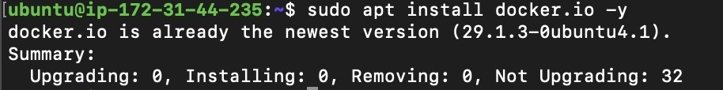

---

# バージョン確認

Dockerが正常にインストールされたことを確認しました。

使用コマンド

```bash
docker --version
```

### 実行画面

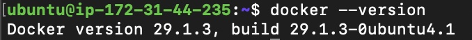

---

# Docker Image取得

Docker HubからNginxイメージを取得しました。

使用コマンド

```bash
sudo docker pull nginx
```

### 実行画面

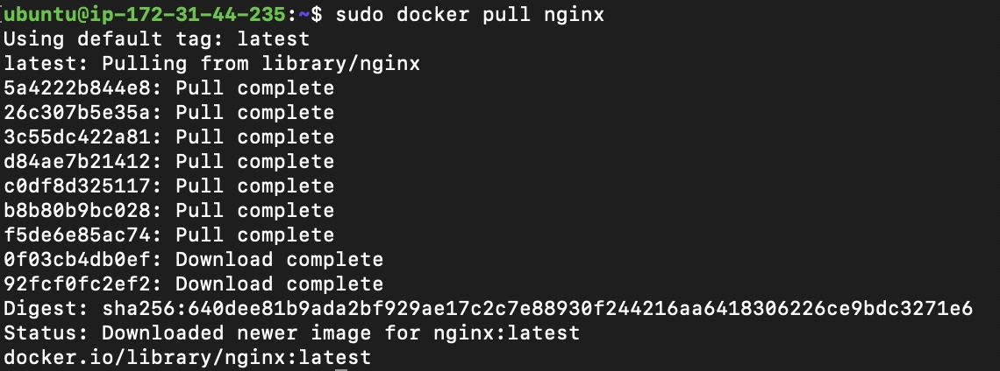

---

# Docker Image確認

取得したイメージを確認しました。

使用コマンド

```bash
sudo docker images
```

取得したNginxイメージと、自作したNode.jsイメージを確認しました。

### 実行画面

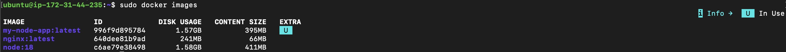

---

# Nginxコンテナ実行

Nginxコンテナを起動しました。

使用コマンド

```bash
sudo docker run -d -p 8080:80 nginx
```

### 実行画面

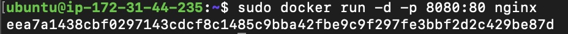

---

# コンテナ確認

起動中のコンテナを確認しました。

使用コマンド

```bash
sudo docker ps
```

コンテナID、イメージ名、ポートマッピングを確認しました。

### 実行画面

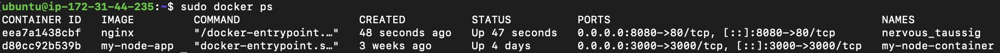

---

# ブラウザ確認

ブラウザからコンテナへアクセスし、Nginxが正常に動作していることを確認しました。

```
http://Public-IP:8080
```

### 実行画面

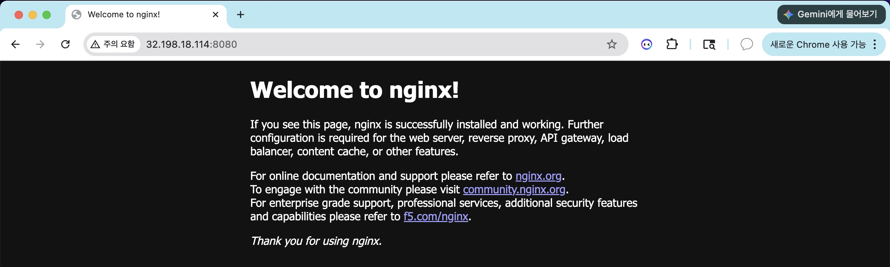

---

# Dockerfile作成

Node.jsアプリケーションをコンテナ化するためにDockerfileを作成しました。

使用コマンド

```bash
nano Dockerfile
```

内容確認

```bash
cat Dockerfile
```

### 実行画面

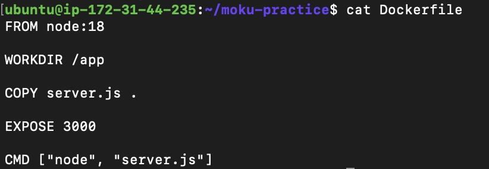

---

# Docker Imageビルド

Dockerfileから独自Imageを作成しました。

使用コマンド

```bash
sudo docker build -t my-node-app .
```

ビルド成功後、

```
Successfully built

Successfully tagged
```

が表示されることを確認しました。

### 実行画面

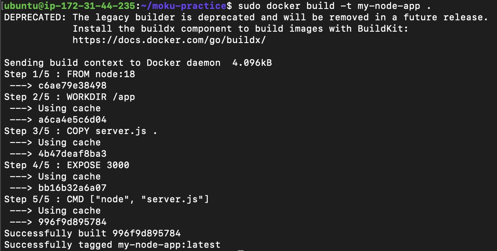

---

# Node.jsコンテナ実行

自作ImageからNode.jsコンテナを起動しました。

使用コマンド

```bash
sudo docker run -d -p 3000:3000 --name my-node-container my-node-app
```

ブラウザからアクセスし、

```
Hello Node Server
```

が表示されることを確認しました。

### 実行画面

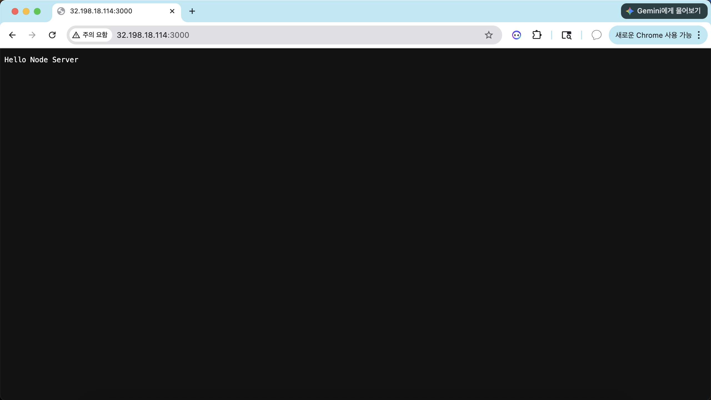

---

# コンテナ内部確認

実行中のコンテナ内部へ接続しました。

使用コマンド

```bash
sudo docker exec -it my-node-container bash
```

コンテナ内部で

```bash
pwd

ls -al
```

を実行し、Dockerfileで指定したファイルが存在することを確認しました。

### 実行画面

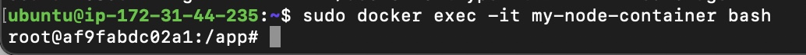

---

# Dockerの構成

Dockerでは、DockerfileからImageを作成し、そのImageをもとにContainerを作成・実行します。

Containerは実行環境であり、同じImageから何度でも再作成できます。

### 構成図

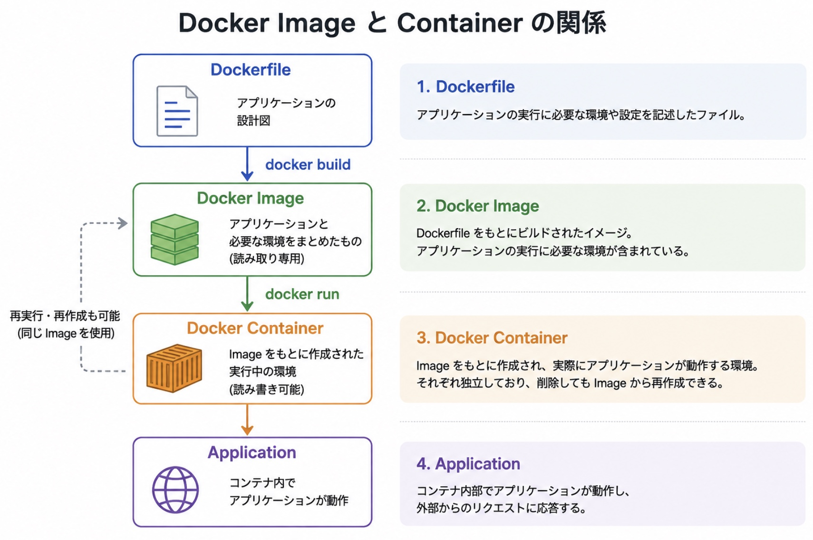

このプロジェクトでは、DockerfileからNode.jsアプリケーションのImageを作成し、そのImageを利用してContainerを起動しました。

その結果、同じ環境を再現しながらアプリケーションを実行できることを確認しました。

---

# 使用した主なコマンド

| コマンド | 用途 |
|----------|------|
| docker pull | Image取得 |
| docker images | Image一覧 |
| docker run | Container起動 |
| docker ps | Container確認 |
| docker build | Image作成 |
| docker exec | Container内部接続 |

---

# 学んだこと

- Dockerを利用してアプリケーションをコンテナ化できること
- Docker ImageとContainerの違い
- Dockerfileから独自Imageを作成する方法
- Port Mappingによって外部からコンテナへアクセスできること
- コンテナ内部へ接続して動作確認できること
- 同じImageから何度でも同じ環境を再現できること
