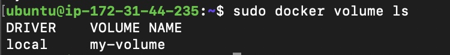
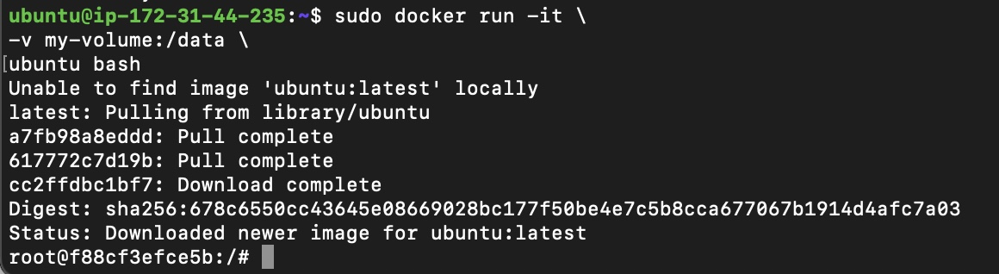
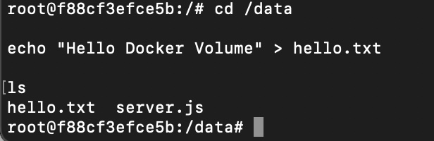
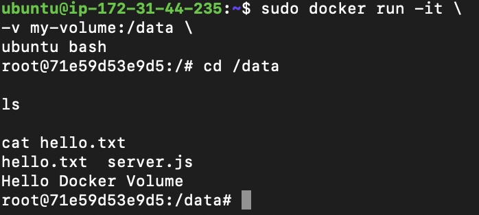
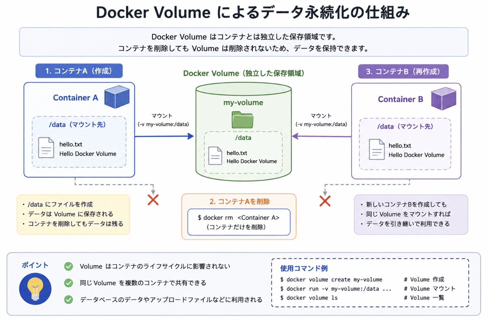

# 06. Docker Volume

## プロジェクト概要

Docker Containerは削除するとコンテナ内部のデータも失われます。

本プロジェクトではDocker Volumeを利用し、コンテナを削除・再作成してもデータが保持されることを確認しました。

---

# Docker Volumeとは

Docker Volumeは、コンテナとは独立してデータを保存するための永続ストレージです。

通常、コンテナ内部のデータはコンテナ削除と同時に失われます。

Docker Volumeを利用することで、コンテナを再作成してもデータを保持できます。

---

# 構築環境

| 項目 | 内容 |
|------|------|
| OS | Ubuntu Linux |
| Container Platform | Docker |
| Storage | Docker Volume |

---

# Volume作成

Docker Volumeを作成しました。

使用コマンド

```bash
sudo docker volume create my-volume
```

### 実行画面


---

# Volume確認

作成したVolumeを確認しました。

使用コマンド

```bash
sudo docker volume ls
```

### 実行画面



---

# Volumeマウント

Volumeを`/data`へマウントしてUbuntuコンテナを起動しました。

使用コマンド

```bash
sudo docker run -it \
-v my-volume:/data \
ubuntu bash
```

### 実行画面



---

# データ保存

コンテナ内部でファイルを作成しました。

使用コマンド

```bash
cd /data

echo "Hello Docker Volume" > hello.txt

ls
```

### 実行画面



---

# コンテナ削除

コンテナを削除しました。

使用コマンド

```bash
exit

sudo docker rm コンテナ名
```

### 実行画面


---

# データ保持確認

新しいコンテナを起動し、Volume内のデータを確認しました。

使用コマンド

```bash
sudo docker run -it \
-v my-volume:/data \
ubuntu bash

cd /data

ls

cat hello.txt
```

作成した`hello.txt`が保持されていることを確認しました。

### 実行画面



---

# Docker Volumeによるデータ永続化の仕組み

Docker Volumeは、コンテナとは独立した保存領域です。

コンテナを削除してもVolume自体は削除されないため、新しいコンテナから同じVolumeをマウントすることで、保存したデータをそのまま利用できます。

### 構成図



### ポイント

- Volumeはコンテナとは独立して管理される
- コンテナを削除してもVolume内のデータは保持される
- 同じVolumeを複数のコンテナで共有できる
- データベースやアップロードファイルなど、永続化が必要なデータ保存に利用される

---

# 使用した主なコマンド

| コマンド | 用途 |
|----------|------|
| docker volume create | Volume作成 |
| docker volume ls | Volume一覧 |
| docker run -v | Volumeマウント |
| docker rm | Container削除 |
| ls | データ確認 |
| cat | ファイル内容確認 |

---

# トラブルシューティング

## コンテナ削除後にデータが消える

### 原因

Container内部へ直接ファイルを保存していました。

### 対応

Docker Volumeを利用し、`/data`へマウントしました。

### 結果

Containerを削除・再作成してもデータが保持されることを確認しました。

---

# 学んだこと

- Container内部のデータは永続化されないこと
- Docker VolumeはContainerとは独立した保存領域であること
- 同じVolumeを複数のContainerで利用できること
- Volumeを利用することでデータを保持したままContainerを再作成できること
- 実務ではデータベースやアップロードファイルなど、消失してはいけないデータにVolumeが利用されること
